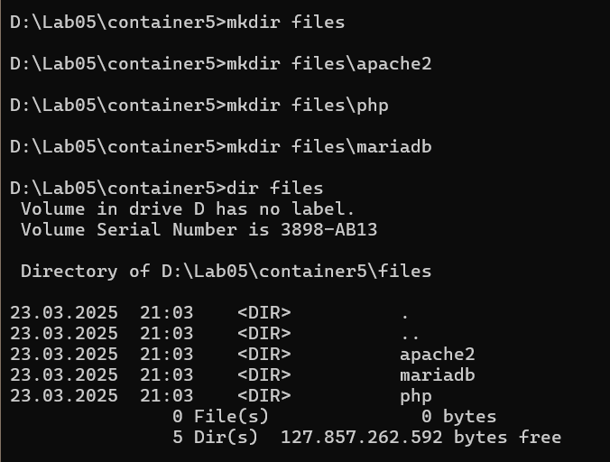
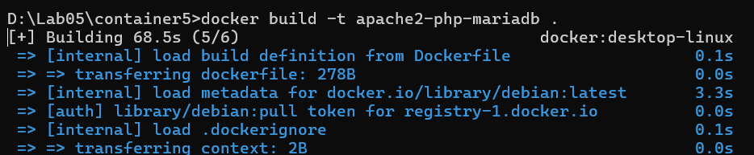
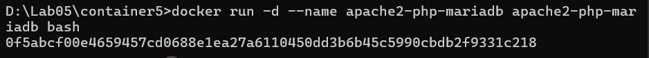
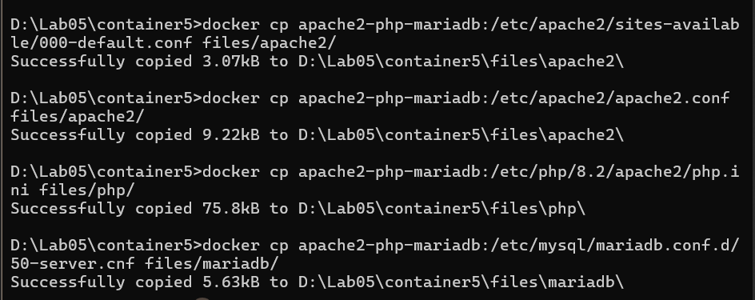
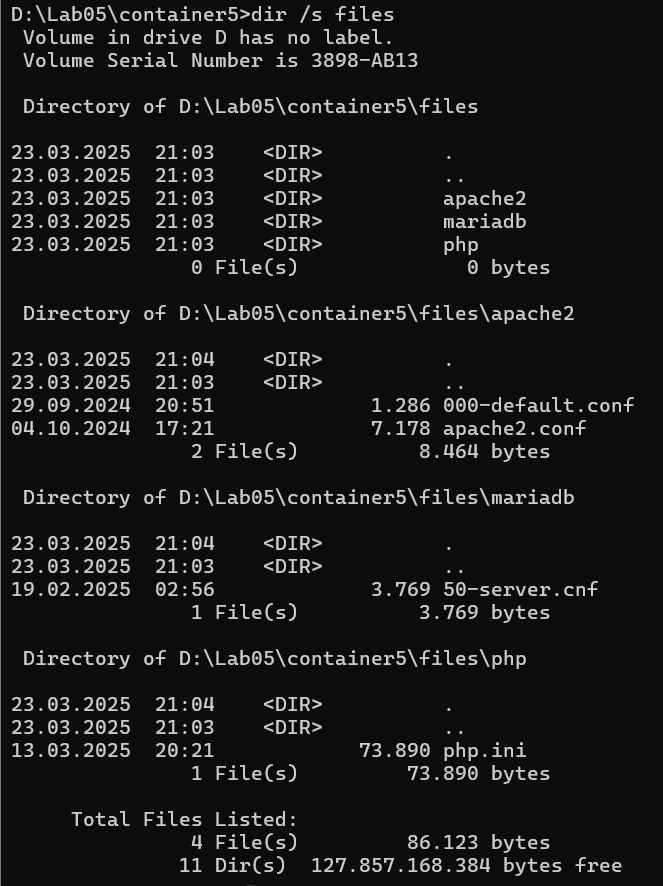
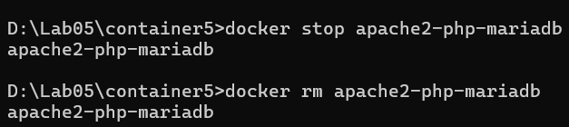
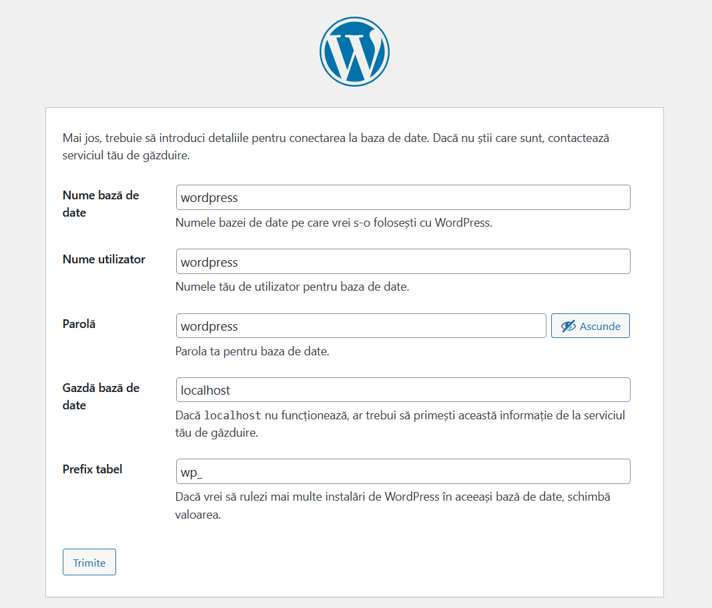

# Lucrarea de laborator nr. 5

## Scopul lucrării

După executarea acestei lucrări, studentul va fi capabil să pregătească un container Docker pentru a rula un site web bazat pe Apache HTTP Server + PHP (mod_php) + MariaDB.

## Sarcina

- Crearea unui fișier `Dockerfile` care să construiască o imagine de container cu Apache HTTP Server, PHP (mod_php) și MariaDB.
- Salvarea fișierelor de configurare în directoare dedicate.
- Instalarea și configurarea WordPress.
- Montarea volumelor pentru datele bazei de date și loguri.
- Crearea unui script de pornire folosind Supervisor.
- Testarea funcționării site-ului WordPress și a containerului.

## Descrierea executării lucrării

### 1. Pregătirea mediului
- S-a creat un repository numit `containers05`.
- În cadrul repository-ului, s-a creat un director `files/` cu următoarele subdirectoare:
  - `files/apache2/ - pentru fișierele de configurare apache2;`
  - `files/php/ - pentru fișierele de configurare php;`
  - `files/mariadb/ - pentru fișierele de configurare mariadb;`
  - `files/supervisor/`



### 2. Crearea Dockerfile-ului inițial
- Dockerfile-ul pornește de la imaginea `debian:latest`.
- Se instalează pachetele necesare: `apache2`, `php`, `libapache2-mod-php`, `php-mysql`, `mariadb-server`, `supervisor`.

```Dockerfile
# create from debian image
FROM debian:latest

# install apache2, php, mod_php for apache2, php-mysql and mariadb
RUN apt-get update && \
apt-get install -y apache2 php libapache2-mod-php php-mysql mariadb-server && \
apt-get clean
```

### 3. Salvarea fișierelor de configurare
- Se creează și se pornește containerul `apache2-php-mariadb` în fundal.

```bash
docker build -t apache2-php-mariadb .
```


  
- Creați un container apache2-php-mariadb din imaginea apache2-php-mariadb și porniți-l în modul de fundal cu comanda bash.

```bash
docker run -d --name apache2-php-mariadb apache2-php-mariadb bash
```


  
- Copiați din container fișierele de configurare apache2, php, mariadb în directorul files/ de pe computer. Pentru a face acest lucru, în contextul proiectului, executați comenzile:

```bash
docker cp apache2-php-mariadb:/etc/apache2/sites-available/000-default.conf files/apache2/
docker cp apache2-php-mariadb:/etc/apache2/apache2.conf files/apache2/
docker cp apache2-php-mariadb:/etc/php/8.2/apache2/php.ini files/php/
docker cp apache2-php-mariadb:/etc/mysql/mariadb.conf.d/50-server.cnf files/mariadb/
```



-Afișăm lista containerelor:



-Ștergem:



### 4. Configurarea fișierelor

#### Apache2
- Se modifică `files/apache2/000-default.conf`:
  - `ServerName localhost`
  - `ServerAdmin` actualizat
  - `DirectoryIndex index.php index.html`
- Se modifică `files/apache2/apache2.conf` pentru a include `ServerName localhost`.
*Salvați fișierul și închideți-l.*
#### PHP
- Se modifică `files/php/php.ini`:
  - `error_log = /var/log/php_errors.log`
  - `memory_limit = 128M`
  - `upload_max_filesize = 128M`
  - `post_max_size = 128M`
  - `max_execution_time = 120`
*Salvați fișierul și închideți-l.*
#### MariaDB
- Se modifică `files/mariadb/50-server.cnf` pentru a activa linia `log_error = /var/log/mysql/error.log`.
*Salvați fișierul și închideți-l.*
### 5. Configurarea Supervisor
- Se creează fișierul `files/supervisor/supervisord.conf` cu configurația pentru a porni atât `apache2`, cât și `mariadb`.
```bash
[supervisord]
nodaemon=true
logfile=/dev/null
user=root

# apache2
[program:apache2]
command=/usr/sbin/apache2ctl -D FOREGROUND
autostart=true
autorestart=true
startretries=3
stderr_logfile=/proc/self/fd/2
user=root

# mariadb
[program:mariadb]
command=/usr/sbin/mariadbd --user=mysql
autostart=true
autorestart=true
startretries=3
stderr_logfile=/proc/self/fd/2
user=mysql
```
*Salvați fișierul și închideți-l.*
### 6. Finalizarea Dockerfile-ului
- Se adaugă volume pentru `/var/lib/mysql` și `/var/log`.
- Se adaugă WordPress:
- Se copiază fișierele de configurare din `files/` în locațiile corespunzătoare din container.
- Se creează directorul `/var/run/mysqld` și se setează permisiunile.
- Se expune portul 80 și se setează comanda de start:
```Dockerfile
 # create from debian image
FROM debian:latest

# mount volume for mysql data
VOLUME /var/lib/mysql

# mount volume for logs
VOLUME /var/log

# install supervisor, apache2, php, mod_php for apache2, php-mysql and mariadb
RUN apt-get update && \
    apt-get install -y supervisor apache2 php libapache2-mod-php php-mysql mariadb-server && \
    apt-get clean

ADD https://wordpress.org/latest.tar.gz /var/www/html/

RUN tar -xzf /var/www/html/latest.tar.gz -C /var/www/html --strip-components=1 && \
    rm /var/www/html/latest.tar.gz && \
    chown -R www-data:www-data /var/www/html

# copy the configuration file for apache2 from files/ directory
COPY files/apache2/000-default.conf /etc/apache2/sites-available/000-default.conf
COPY files/apache2/apache2.conf /etc/apache2/apache2.conf

# copy the configuration file for php from files/ directory
COPY files/php/php.ini /etc/php/8.2/apache2/php.ini

# copy the configuration file for mysql from files/ directory
COPY files/mariadb/50-server.cnf /etc/mysql/mariadb.conf.d/50-server.cnf

# copy the supervisor configuration file
COPY files/supervisor/supervisord.conf /etc/supervisor/supervisord.conf

# create mysql socket directory
RUN mkdir /var/run/mysqld && chown mysql:mysql /var/run/mysqld

EXPOSE 80

# start supervisor
CMD ["/usr/bin/supervisord", "-n", "-c", "/etc/supervisor/supervisord.conf"]
```
Creati imaginea containerului cu numele apache2-php-mariadb și porniți containerul apache2-php-mariadb din imaginea apache2-php-mariadb.
```bash
docker build -t apache2-php-mariadb .
docker run -d --name apache2-php-mariadb -p 80:80 apache2-php-mariadb
```
### 7. Configurarea WordPress
- Verificați dacă site-ul WordPress este disponibil la adresa localhost.
- Verificați dacă in directorul /var/www/html/ există fișierele site-ului WordPress.
- Verificați dacă fișierele de configurare apache2, php, mariadb sunt modificate.
- Crearea bazelor de date și a utilizatorului pentru WordPress se face în containerul apache2-php-mariadb. Pentru a face acest lucru, conectați-vă la containerul apache2-php-mariadb.

```bash
docker exec -it apache2-php-mariadb mysql
```
  
- Se creează baza de date și utilizatorul în MariaDB:
  ```sql
  CREATE DATABASE wordpress;
  CREATE USER 'wordpress'@'localhost' IDENTIFIED BY 'wordpress';
  GRANT ALL PRIVILEGES ON wordpress.* TO 'wordpress'@'localhost';
  FLUSH PRIVILEGES;
  ```
- Deschideți în browser site-ul WordPress la adresa http://localhost/ și urmați instrucțiunile pentru instalarea site-ului WordPress. La pasul 2, specificați următoarele date:

```bash
Numele bazei de date: wordpress;
Utilizatorul bazei de date: wordpress;
Parola bazei de date: wordpress;
Adresa bazei de date: localhost;
Prefixul tabelelor: wp_.
```



- Se finalizează instalarea WordPress din browser și se salvează fișierul `wp-config.php` în `files/`.
- Se adaugă în Dockerfile copierea acestuia:
  ```Dockerfile
  COPY files/wp-config.php /var/www/html/wordpress/wp-config.php
  ```

### 8. Testarea
- Se recreează imaginea și se pornește containerul.

```bash
docker build -t apache2-php-mariadb .
docker run -d --name apache2-php-mariadb -p 80:80 apache2-php-mariadb
```

- Se verifică funcționarea WordPress la `http://localhost/`.
- Se confirmă existența fișierelor WordPress în `/var/www/html/wordpress`.
- Se verifică dacă fișierele de configurare au fost modificate conform cerințelor.

## Întrebări și răspunsuri

**Ce fișiere de configurare au fost modificate?**
- `apache2.conf`
- `000-default.conf`
- `php.ini`
- `50-server.cnf`
- `wp-config.php`

**Pentru ce este responsabilă instrucția DirectoryIndex din fișierul de configurare apache2?**
- Specifică ordinea în care Apache caută fișierele index (ex: `index.php`, `index.html`) în directorul rădăcină.

**De ce este necesar fișierul wp-config.php?**
- Conține datele de conectare la baza de date și configurațiile necesare funcționării WordPress.

**Pentru ce este responsabil parametrul post_max_size din fișierul de configurare php?**
- Definește dimensiunea maximă permisă pentru datele trimise prin POST (inclusiv fișierele încărcate).

**Specificați, în opinia dvs., care sunt deficiențele imaginii containerului creat?**
- Nu include un sistem de backup automat pentru baza de date.
- Nu are o interfață de administrare MariaDB (ex: phpMyAdmin).
- Nu include certificate SSL pentru acces HTTPS.
- Instalarea WordPress se face manual, fără script automatizat.

## Concluzii

Această lucrare a demonstrat procesul de construire a unei imagini Docker personalizate pentru un site WordPress, folosind servicii esențiale precum Apache2, PHP și MariaDB. Prin extragerea, modificarea și integrarea fișierelor de configurare, am învățat cum să pregătim un mediu de dezvoltare stabil și funcțional. Configurația realizată permite rularea unui site WordPress pe localhost, cu baze de date persistente și loguri bine gestionate. Lucrarea contribuie la aprofundarea cunoștințelor privind containerele, volumele, precum și automatizarea serviciilor folosind `supervisord`, consolidând astfel baza necesară pentru dezvoltarea și gestionarea aplicațiilor web moderne.

